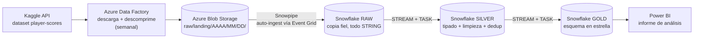
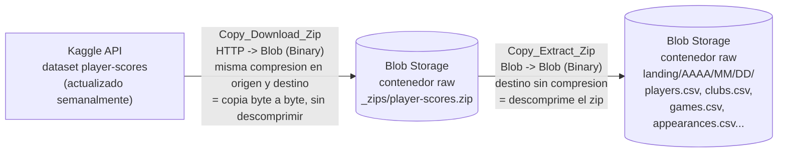

# Arquitectura del pipeline — Proyecto p2-futbol

Pipeline de datos completo, de punta a punta, para el análisis de valor de mercado y traspasos de futbolistas: desde la descarga automática del dataset [Football Data from Transfermarkt](https://www.kaggle.com/datasets/davidcariboo/player-scores) de Kaggle hasta un informe de Power BI, pasando por un modelado en tres capas (RAW → SILVER → GOLD) en Snowflake.

> **Estado**: pipeline completo implementado de punta a punta — Kaggle → Azure Blob Storage (ADF) → Snowflake RAW → SILVER → GOLD → Power BI —, con ingesta y transformación automatizadas por eventos (Snowpipe + Event Grid) y por `STREAM`/`TASK` en Snowflake, sin intervención manual en la operación semanal.

## Visión general

Cada fase se automatiza con el mecanismo nativo del servicio donde vive, en vez de una orquestación central que las conecte a todas: un *trigger* semanal en ADF, Snowpipe con auto-ingest para Blob → RAW, y `STREAM`+`TASK` encadenadas para RAW → SILVER → GOLD. El resultado es una cadena que se refresca sola cada semana sin que nadie tenga que ejecutar nada a mano, con cada eslabón desacoplado del siguiente (si uno falla, los demás no se bloquean, solo trabajan con el dato que ya tenían).

Documentación detallada de cada fase:

| Fase | Qué hace | Documentación |
|---|---|---|
| 1. Ingesta | Kaggle → Azure Blob Storage, vía Azure Data Factory | Este documento (sección 1) |
| 2a. RAW | Blob → Snowflake, copia fiel sin tipar | [`sql/raw/README.md`](sql/raw/README.md) |
| 2b. SILVER | Tipado, limpieza y deduplicación | [`sql/silver/README.md`](sql/silver/README.md) |
| 2c. GOLD | Esquema en estrella para consumo analítico | [`sql/gold/README.md`](sql/gold/README.md) |
| 3. Consumo | Informe de Power BI sobre GOLD | Este documento (sección 3) |

## 1. Ingesta: Kaggle → Azure Blob Storage (Azure Data Factory)

Descarga automática y semanal del dataset de Kaggle hacia una zona *raw* en Azure Blob Storage, orquestada con Azure Data Factory (ADF).

### 1.1 Flujo del dato

Los tres pasos, en palabras:

1. **Descarga** — ADF llama al endpoint de la API de Kaggle (`GET /api/v1/datasets/download/davidcariboo/player-scores`) y copia la respuesta, tal cual (comprimida), al contenedor `raw` de Blob Storage. No se descomprime en este paso porque una fuente HTTP normal no soporta lectura aleatoria (*seek*), y el formato ZIP la necesita para leer su índice de archivos.
2. **Almacenamiento intermedio** — el `.zip` queda aparcado en `raw/_zips/player-scores.zip`. Se conserva (no se borra) como copia exacta de lo que sirvió Kaggle esa semana: permite reprocesar la extracción sin volver a golpear la API si algo falla más adelante.
3. **Descompresión con partición por fecha** — una segunda actividad lee ese mismo zip, ahora desde Blob (que sí soporta lectura aleatoria), y extrae los CSV a `raw/landing/AAAA/MM/DD/`, usando la fecha de ejecución del pipeline. Cada semana genera una carpeta nueva, conservando el histórico completo de snapshots en vez de sobrescribir el anterior.

### 1.2 Recursos creados y relación entre ellos

| Recurso | Nombre | Tipo | Papel |
|---|---|---|---|
| Grupo de recursos | `rg-p2-futbol` | Resource Group | Agrupa el ciclo de vida de todo lo de esta fase |
| Data Factory | `adf-mfontenlos-p2-futbol` | Azure Data Factory (V2) | Contiene el pipeline, los datasets, los linked services y el trigger |
| Storage Account | `stp2futbolmfontenlos`  | Blob Storage (Standard, LRS) | Zona *raw*: contenedor `raw`, con `_zips/` y `landing/AAAA/MM/DD/` |
| Key Vault | `kv-p2futbol-mfontenlos` | Azure Key Vault (RBAC) | Guarda los secretos `kaggle-username` y `kaggle-key` |

**Identidad y permisos**: el Data Factory usa su *Managed Identity* (system-assigned) para autenticarse contra los otros dos recursos sin ninguna clave almacenada en ADF:

- **Key Vault Secrets User** sobre el Key Vault → puede leer secretos, no gestionarlos.
- **Storage Blob Data Contributor** sobre el Storage Account → puede leer y escribir blobs.

**Linked Services** (las conexiones que usa ADF):

| Linked Service | Tipo | Autenticación | Apunta a |
|---|---|---|---|
| `LS_KeyVault` | Azure Key Vault | Managed Identity | `kv-p2futbol-mfontenlos` |
| `LS_BlobStorage_Raw` | Azure Blob Storage | System Assigned Managed Identity | Storage Account, contenedor `raw` |
| `LS_HTTP_Kaggle` | HTTP | Basic — usuario en texto plano, contraseña leída desde `LS_KeyVault` (secreto `kaggle-key`) | `https://www.kaggle.com/api/v1/` |

**Datasets** (qué se lee/escribe en cada Linked Service):

| Dataset | Linked Service | Ruta | Compresión | Papel |
|---|---|---|---|---|
| `DS_Kaggle_Zip_Source` | `LS_HTTP_Kaggle` | `datasets/download/davidcariboo/player-scores` | ZipDeflate | Origen: el zip tal como lo sirve Kaggle |
| `DS_Blob_Zip_Staging` | `LS_BlobStorage_Raw` | `raw/_zips/player-scores.zip` | ZipDeflate | Intermedio: mismo zip aparcado en Blob |
| `DS_Blob_Raw_Extracted` | `LS_BlobStorage_Raw` | `raw/landing/{yyyy}/{mm}/{dd}/` (fecha dinámica) | Ninguna | Destino final: CSV descomprimidos |

**Pipeline y trigger**:

- **Pipeline** `PL_Ingest_Kaggle_Weekly`
  - Actividad `Copy_Download_Zip`: `DS_Kaggle_Zip_Source` → `DS_Blob_Zip_Staging`.
  - Actividad `Copy_Extract_Zip` (se ejecuta solo si la anterior tiene éxito): `DS_Blob_Zip_Staging` → `DS_Blob_Raw_Extracted`.
- **Trigger** `TR_Weekly_Kaggle_Sync`: tipo *Schedule*, recurrencia semanal, zona horaria Madrid. Publicado junto con el pipeline (`Publish all`) para quedar activo.

## 2. Transformación en Snowflake: RAW → SILVER → GOLD

De Blob a Snowflake y, dentro de Snowflake, de un aterrizaje sin tipar a un esquema en estrella listo para Power BI. Cada capa tiene su propio README con el detalle completo (decisiones de diseño, automatización, estructura de archivos); aquí solo el resumen de qué responsabilidad tiene cada una:

- **[RAW](sql/raw/README.md)** — aterrizaje fiel del CSV dentro de Snowflake, todo `STRING`, sin ninguna limpieza. La ingesta desde Blob es automática y basada en eventos: Snowpipe con `AUTO_INGEST`, activado por notificaciones de Azure Event Grid cuando llega un blob nuevo — no hay sondeo ni horario propio en Snowflake para esta capa.
- **[SILVER](sql/silver/README.md)** — tipado real (`TRY_CAST`), estandarización de nulos y deduplicación por clave de negocio (`QUALIFY ROW_NUMBER()`). La automatización RAW → SILVER usa `STREAM` (qué filas son nuevas) + `TASK` programada (cada sábado 8:30, Europe/Madrid) con un `MERGE` idempotente.
- **[GOLD](sql/gold/README.md)** — esquema en estrella (5 dimensiones + 3 hechos + 1 vista de reporting) con la lógica de negocio del proyecto: cálculo de `SCORE` tipo Bota de Oro tiered por país de competición, criterio de valor de mercado, y las ampliaciones sobre el mínimo del enunciado (`FACT_TRANSFER`, `FACT_CLUB_GAME`, `FACT_PLAYER_MARKET_VALUE`, `VW_PLAYER_VALUE_TIMELINE`). Automatización GOLD → mismo patrón `STREAM`+`TASK` que SILVER, programada 30 minutos después (9:00).

Las tres capas encadenan su periodicidad con el mismo criterio: 30 minutos de margen entre capa y capa, anclados a la hora real en que llega dato nuevo desde ADF (8:00), no a un sondeo arbitrario.

## 3. Consumo: informe de Power BI

El informe (`informe_futbol_mejorado.pbip`) se conecta directamente a `FOOTBALL.GOLD` y no aplica ninguna transformación de datos propia (Power Query solo importa; toda la lógica de limpieza y de negocio ya vive en SILVER/GOLD). Sí añade, en el modelo semántico (TMDL), medidas DAX y un puñado de columnas calculadas cuando la necesidad es específica de un visual concreto y no una entidad de negocio reutilizable — por eso viven en el informe y no se han empujado a GOLD:

- **`FACT_TRANSFER`**: medidas `Total Invertido` (`SUM(TRANSFER_FEE)`) y `Número de Fichajes` (`COUNTROWS`), para los KPI de la página de Transferencias; columnas calculadas `AGE_AT_TRANSFER` (edad del jugador en la fecha del traspaso, vía `RELATED(DIM_PLAYER[DATE_OF_BIRTH])`) y `AGE_BRACKET`/`AGE_BRACKET_SORT` (franja de edad con orden custom), usadas en el gráfico de burbujas que cruza edad, importe invertido y número de fichajes.

**Páginas del informe**:

| Página | Contenido |
|---|---|
| Overview | Vista general del dataset completo |
| Análisis Jugadores | Comparativa y ranking de jugadores, con la tabla de detalle jugador-temporada-club-competición |
| Detalle Jugador (drillthrough) | Ficha de un jugador: datos personales, evolución de valor de mercado combinada con traspasos (`VW_PLAYER_VALUE_TIMELINE`), historial de transferencias, detalle por temporada y competición |
| Transferencias | Fichajes más caros, importe pagado vs. valor de mercado, gasto por posición, evolución del gasto por temporada, y el cruce edad/importe/nº de fichajes |
| Portada | Página de inicio con navegación a las demás páginas — en construcción: la navegación funciona por defecto de Power BI (acción de página en los botones, configurada manualmente en Desktop); el estilo visual (relleno translúcido, texto) también se está terminando de ajustar a mano en el panel de Formato |

No existe todavía un README dedicado a esta capa (el informe cambia con más frecuencia que el modelo de datos); este resumen se mantiene aquí, en el documento general, y se ampliará o se separará en su propio archivo si el informe crece mucho más.
